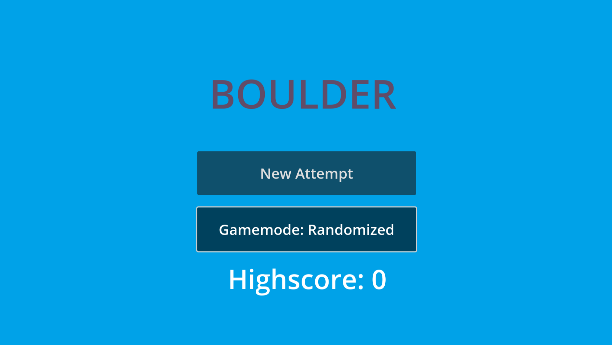
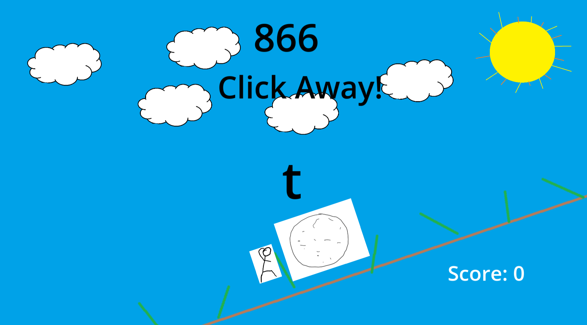

# Boulder
<a href="https://robrob7.github.io/Boulder/WebGame/Boulder.html" target="_blank" rel="noopener noreferrer">Play Now</a>

Boulder is a fast-paced endurance game built with Godot 4.3, featuring two adrenaline-fueled modes that test your speed and accuracy.

You play as a lone character struggling to push a massive boulder up a hill before time runs out. The clock is always ticking, and when it hits zero, the boulder rolls back and crushes you.

- Mode 1 – Normal: Mash the space bar as fast as you can to rack up points before the timer hits zero. Each press adds a little more time, keeping the chaos going as long as your fingers can keep up.

- Mode 2 – Randomized: Stay sharp and hit the correct key displayed on screen before time runs out! Each correct press rewards you with bonus time.

With simple controls, clean visuals, and addictive time-based challenges, Key Rush is a quick test of focus and reflexes that’s easy to play but hard to master.




Development Team:
- RobRob7
- jewelking888
- Mahesh1998
- KwabenaAduAgyemang

<h2>
Requirements
</h2>

- To play: browser that supports WebAssembly and WebGL 2.0 (Firefox, Chrome, Opera, Edge)
- To open with Godot: Godot v4.3 required 
    - ```git clone https://github.com/RobRob7/Boulder.git```
    - Import project with Godot using ```boulder/project.godot```
